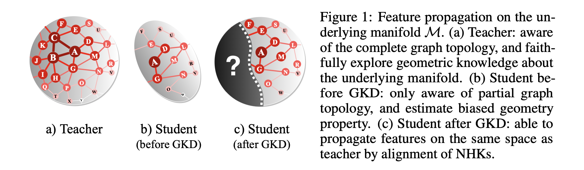

## Geometric Knowledge Distillation: Topology Compression for Graph Neural Networks

The official implementation for "Geometric Knowledge Distillation: Topology Compression for Graph Neural Networks" which is accepted to NeurIPS22. 

**Abstract:** We study a new paradigm of knowledge transfer that aims at encoding graph topological information into graph neural networks (GNNs) by distilling knowledge from a teacher GNN model trained on a complete graph to a student GNN model operating on a smaller or sparser graph. To this end, we revisit the connection between thermodynamics and the behavior of GNN, based on which we propose Neural Heat Kernel (NHK) to encapsulate the geometric property of the underlying manifold concerning the architecture of GNNs. A fundamental and principled solution is derived by aligning NHKs on teacher and student models, dubbed as Geometric Knowledge Distillation. We develop non- and parametric instantiations and demonstrate their efficacy in various experimental settings for knowledge distillation regarding different types of privileged topological information and teacher-student schemes.

Related materials: 
[paper](https://openreview.net/pdf?id=7WGNT3MHyBm)



### Use the Code

- Install the required package according to `requirements.txt`.
- Specify your own data path in `parse.py` and download the datasets.
- Pretrain teacher models, which will be saved in the folder `/saved_models`
```
python main.py --dataset cora --rand_split --use_bn --base_model gcn --mode pretrain --dist_mode no --save_model 
```
- Train student models, e.g.,
```
python main.py --dataset cora --rand_split --use_bn --base_model gcn --mode train --priv_type edge --dist_mode gkd --kernel sigmoid
```

### Citation
If you find our codes useful, please consider citing our work
```bibtex
      @inproceedings{yang2022geometric,
      title = {Geometric Knowledge Distillation: Topology Compression for Graph Neural Networks},
      author = {Chenxiao Yang and Qitian Wu and Junchi Yan},
      booktitle = {Advances in Neural Information Processing Systems (NeurIPS)},
      year = {2022}
      }
```

### ACK
The pipeline for training and preprocessing is developed on basis of the Non-Homophilous Benchmark project.